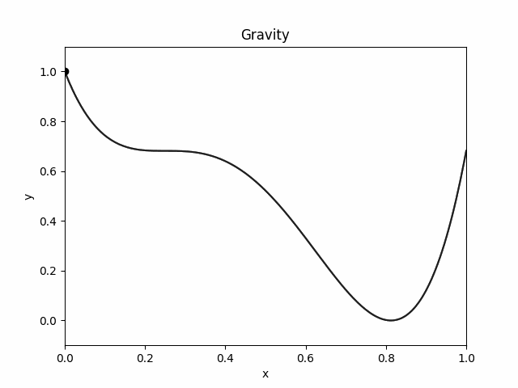

# Visualizing momentum

"Momentum" in optimization theory is usually introduced as an ad-hoc improvement over vanilla gradient descent. By leveraging moving averages over gradients, the optimizer manages not to get stuck in inflections or bad minimas. But momentum is so much more. Quoted from this brilliant [article](https://distill.pub/2017/momentum/):

<it>"For now — momentum is an algorithm for the book."</it>

## Newtonion Mechanics

For now, consider a body of mass $m$ at location $\textbf{x}$ with a force $\textbf{f}$ acting on it. Then Newton said we can say,
$$m\ddot{\textbf{x}} = \textbf{f}$$
Now $f$ could be a single force, or it could be a vector addition of all the multiple forces acting on the body. It could also be a function of $\textbf{x}$, like in a spring.

Consider two forces, $\textbf{g}_x$ which is a function of space $\textbf{x}$ and another 'drag force' proportional to velocity $\dot{x}$ acting in the direction opposite to the movement.

$$m\ddot{\textbf{x}} =  \textbf{g}_x - \nu \dot{\textbf{x}}$$

This is a pretty general mechanics problem statement - A free moving body operating under a force induced by a potential energy field and some friction. Consier, a 1-D space where each point $x$ ($x$ is a scalar now) has a potential energy given by a function, say $f(x)$. This induces on the particle a force proportional to $-\nabla_x f$ (or $\frac{df}{dx}$ or $f^{\prime}$, since we are dealing with scalars).

$$m\ddot{\textbf{x}} = -\eta \nabla_x f - \nu \dot{\textbf{x}}$$

Now for the hard part. You may have often tried to visualize a higher dimensional space in a lower dimension. I am going to ask you to do the opposite. Imagine this 1-D space in 2-D. The first dimension $x$ corresponds to the original $x$, the location of the point. The second dimension $y$ measures the potential energy of the body. Notice that this is still a 1D problem, since $y$ is completely known from $x$ using $y = f(x)$. The degree of freedom is still **1**.

You can think of the body as a bead on a wire. The shape of the wire is $f(x)$. At any point the body experiences a force in the direction opposite to the slope of the wire, proportional to that slope. Simultaneously it also experiences a drag force opposite to the slope that is proportional to the speed of the bead $|\dot{x}\hat{i} + \dot{y}\hat{i}|$

